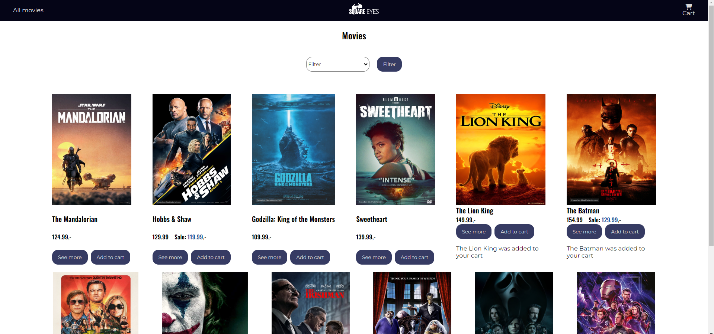

# JavaScript 1 Course Assignment
## Square Eyes

### Description
This course assignment takes a movie api and displays the movies on a home page, you can add items to cart, remove them from your cart and there is a checkout success page.
It contains error handling for errors in API call and if the user tries to add a movie thats already in the cart.
There is a filtering function that filters the movies genres and display the movies in the chosen genre.
This application uses localStorage to save information.

You can view a deployed demo of the project [here](https://js1-ca.vercel.app/)

#### Features
 - Fetch and display movies from a movie API on the home page.
 - Add movies to the cart.
 - Remove movies from the cart.
 - Display a checkout success page after the purchase.
 - Handle errors related to API calls.
 - Prevent adding the same movie to the cart more than once.
 - Filter movies by genre and display movies of the selected genre.
 - Save cart information and other necessary data in localStorage for persistence.

### Technologies
JavaScript  
HTML  
CSS
Figma

### Project Roadmap
I would love to further enhance the design and add more functionality to the project.

### License
This project is licensed under the MIT License - see the LICENSE.md file for details
